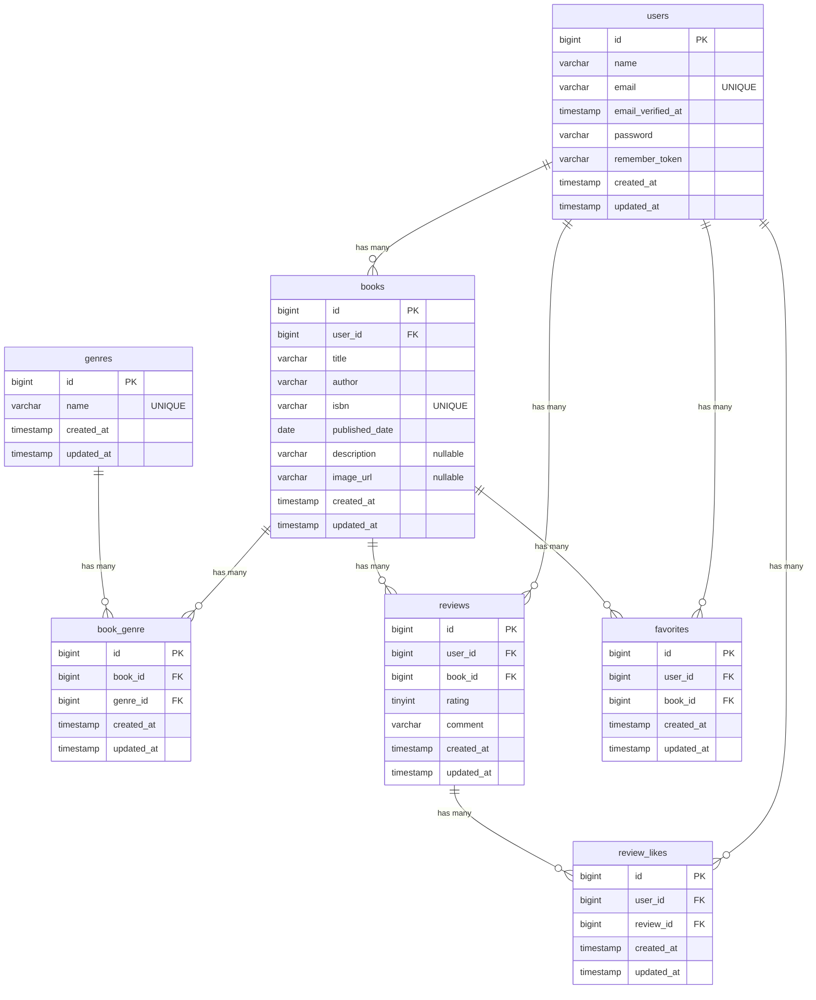

# BookShelf 書籍レビューアプリ

## 概要

本アプリケーションは、書籍の登録・一覧表示・詳細表示と、ログインユーザーによるレビューの投稿・編集・削除を提供するWebアプリケーションです。
会員登録とログインにはLaravel Fortifyを使用しています。

## 作成者

溝口　竣介

## 使用技術

- PHP 8.5
- Laravel 10.x
- MySQL 8.4
- Vite
- Tailwind CSS 3.4
- @tailwindcss/forms
- Laravel Fortify
- Docker / Laravel Sail
- phpMyAdmin
- PHPUnit 10.x
- Git / GitHub

## ER図



## 開発環境URL

- 開発環境：http://localhost
- phpMyAdmin：http://localhost:8080

## 動作環境

本アプリケーションは**Docker（Laravel Sail）**を利用して動作します。

## 環境構築手順

1. **リポジトリをクローン**

    リポジトリをクローンします。
    ```bash
    git clone git@github.com:shunsukem1993-a11y/attendance-app.git
    ```
    クローンしたプロジェクトディレクトリに移動します。
    ```bash
    cd attendance-app
    ```

2. **.envファイルの準備**
    
    .env.exampleをコピーして.envファイルを作成します。
    ```bash
    cp .env.example .env
    ```

    .envのデータベース設定が以下になっていることを確認してください。

    ```env
    DB_CONNECTION=mysql
    DB_HOST=mysql
    DB_PORT=3306
    DB_DATABASE=laravel
    DB_USERNAME=sail
    DB_PASSWORD=password

    MAIL_MAILER=smtp
    MAIL_HOST=mailpit
    MAIL_PORT=1025

3. **Composer依存パッケージのインストール**

    Composerで依存パッケージをインストールします。
    ```bash
    docker run --rm \
    -u "$(id -u):$(id -g)" \
    -v "$(pwd):/var/www/html" \
    -w /var/www/html \
    -e COMPOSER_CACHE_DIR=/tmp/composer_cache \
    laravelsail/php82-composer:latest \
    composer install --ignore-platform-reqs
    ```

4. **Laravel Sailの起動**

    Dockerコンテナを起動します。
    ```bash
    ./vendor/bin/sail up -d
    ```

5. **アプリケーションキーの生成**

    Laravelのアプリケーションキーを生成します。
    ```bash
    ./vendor/bin/sail artisan key:generate
    ```

6. **データベースのマイグレーションと初期データ投入**

    テーブルを作成し、シーダーを実行します。
    ```bash
    ./vendor/bin/sail artisan migrate --seed
    ```

7. **フロントエンドのビルド**

    Node.jsの依存パッケージをインストールし、開発用ビルドを実行します。
    ```bash
    ./vendor/bin/sail npm install
    ./vendor/bin/sail npm run dev
    ```

8. **アプリケーションへのアクセス**

    ブラウザで以下のURLにアクセスします。
    ```bash
    http://localhost
    ```

## テスト実行

PHPUnitによるテストを実行する場合は、以下のコマンドを実行してください。
```bash
./vendor/bin/sail test
```

特定のテストファイルのみを実行する場合は、以下のように指定できます。
```bash
./vendor/bin/sail artisan test --filter=テストファイル名
```

例：
```bash
./vendor/bin/sail artisan test --BookIndexTest
```

## 機能一覧


## APIエンドポイント一覧

本アプリケーションで提供している主なREST APIの一覧です。

書籍レビューAPI

| HTTPメソッド | URI | 概要 | 認証| 認証・認可 |
| ---------- | ---------------------------------------------- | ------ | --------- | --------------------------------------- |
